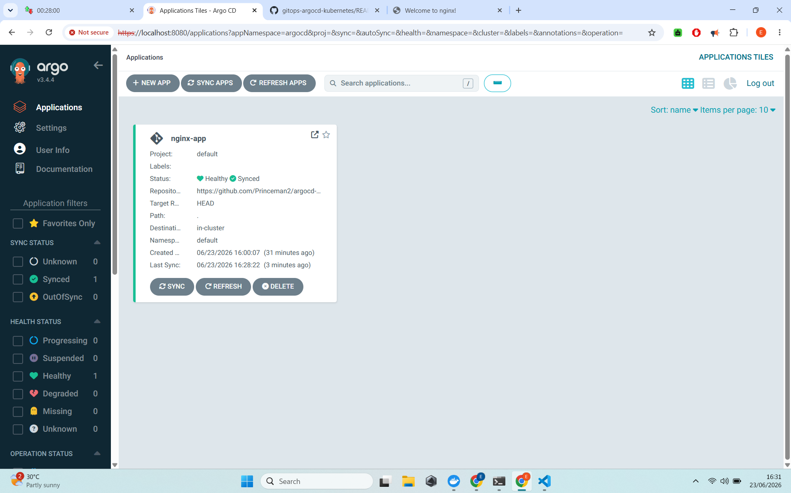
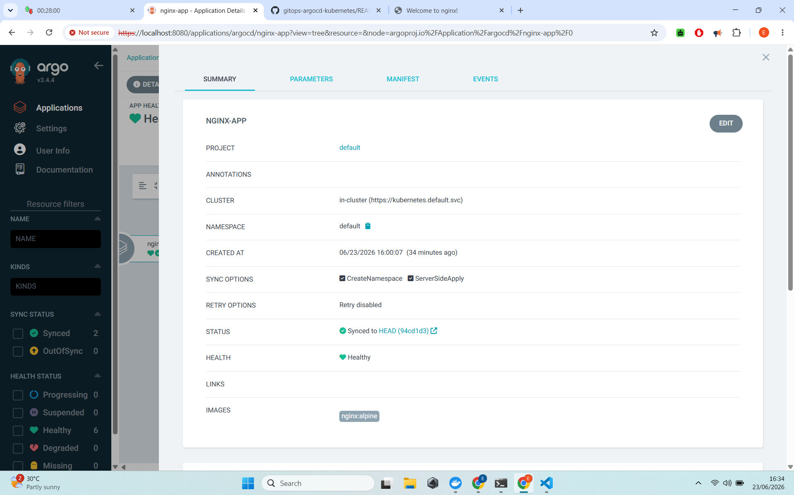
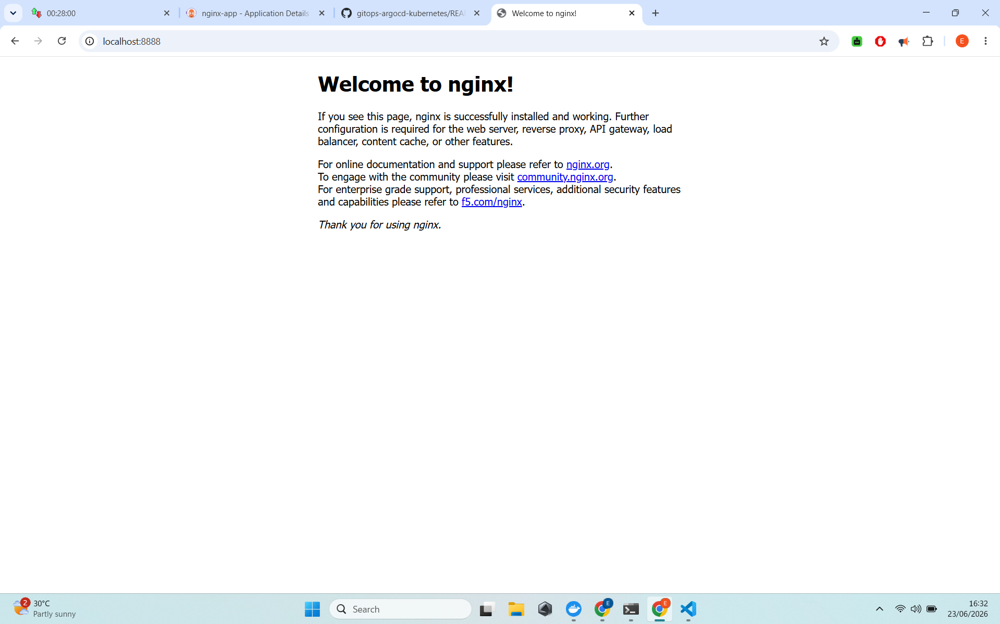
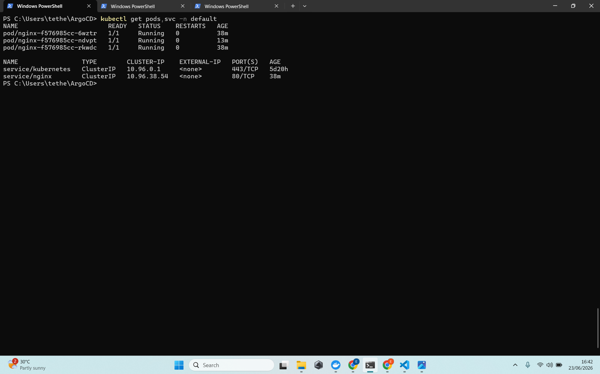
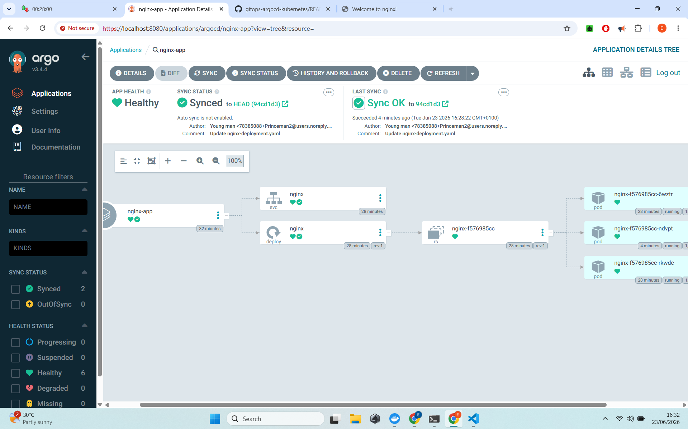

# GitOps with ArgoCD on Kubernetes

**Automated, declarative deployments using GitOps principles with ArgoCD**

---

## 📋 Project Summary

Implemented **GitOps** practices using **ArgoCD** on a local Kubernetes cluster (Kind). Changes pushed to GitHub are automatically detected and deployed to the cluster, demonstrating modern, reliable deployment workflows.

**Status**: Fully Functional

---

## 🎯 Objectives & Achievements

- Set up ArgoCD on Kubernetes
- Connected ArgoCD to a GitHub repository as the single source of truth
- Deployed and managed applications declaratively
- Demonstrated automatic synchronization between Git and live cluster state
- Experienced the full GitOps workflow (push → auto-deploy)

---

## 🛠️ Technologies Used

| Category              | Technology                              |
|-----------------------|-----------------------------------------|
| GitOps Tool           | ArgoCD                                  |
| Kubernetes            | Kind (local cluster)                    |
| Version Control       | Git & GitHub                            |
| Application           | Nginx (example)                         |

---

## 📸 Project Screenshots

### 1. ArgoCD Applications Overview

### 2. Application Details & Sync Status

### 3. Deployed Nginx Application in Browser

### 4. Kubernetes Resources Created by ArgoCD

### 5. ArgoCD UI with Live Resources

---

## 🧩 Architecture & Workflow

- GitHub repository acts as the **Single Source of Truth**
- ArgoCD continuously monitors the repo
- Changes in Git → ArgoCD automatically syncs them to Kubernetes
- Full visibility and audit trail through Git history

---

## 💡 Skills Demonstrated

- GitOps methodology and principles
- ArgoCD installation and configuration
- Declarative application management
- Automated synchronization and drift detection
- Modern DevOps practices for reliable deployments

---

## 🚀 How to Reproduce

1. Set up a Kind Kubernetes cluster
2. Install ArgoCD
3. Create an application in ArgoCD pointing to a GitHub repo
4. Push changes to Git → Watch ArgoCD deploy them automatically

---

**Built locally with ❤️**  
**Completed**: June 2026
